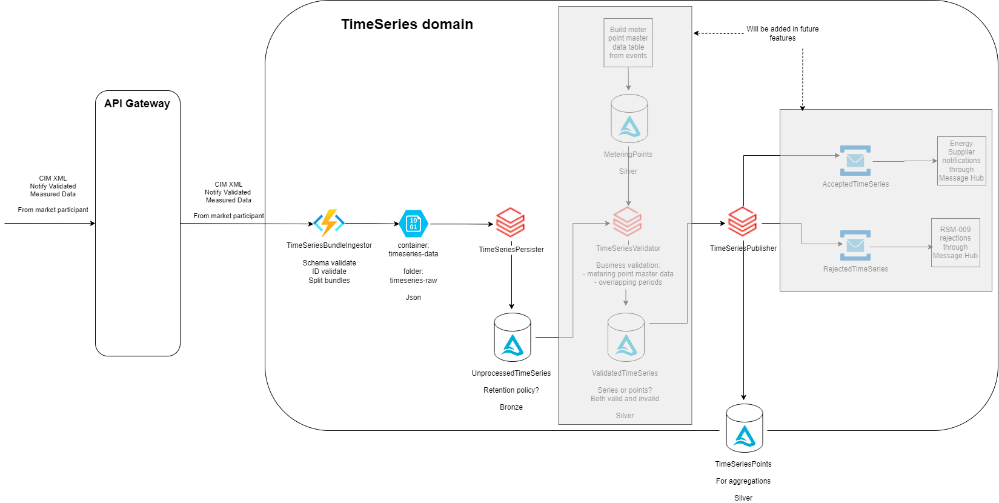
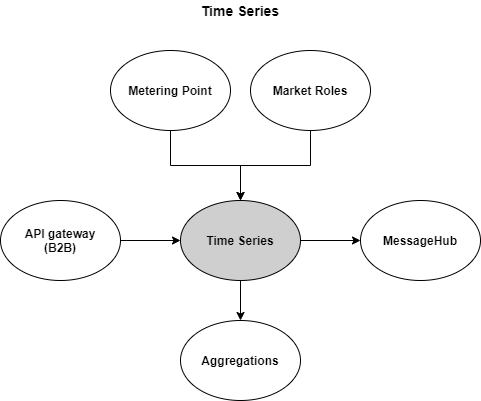

# Time Series

## Intro

The time series domain focuses primarily on receiving, validating, storing and distributing time series data to relevant market participants to be used for billing, etc.

A time series is a message containing a collection of measurements for a given Metering Point and it documents the amount of electricity being consumed, produced or exchanged. The measurements received can come in different resolutions e.g. hourly or 15 minutes values, although the domain is built with the intend for higher resolutions like 5 minutes or higher.

Performance is essential for this time series engine as the expected through-put will be high. Current performance target is processing 16 million time series values per hour, but this figure is expected to be raised significantly.

The domain is also in charge of responding to time series data requests from market participants, and it is a key input data provider for the calculations performed by the [Aggregations domain](https://github.com/Energinet-DataHub/geh-aggregations) in order to settle the electricity market.

These are the business processes maintained by this domain.

| Processes |
| ------------- |
| [Submission of time series data](docs/business-processes/submission-of-time-series-data.md) |
| [Request for time series data](docs/business-processes/request-for-time-series-data.md) |
| [Request for historical time series data](docs/business-processes/request-for-historical-time-series-data.md) |
| ... |

## Architecture

Upon receipt of a time series message, the data gets processed within [Databricks](https://databricks.com/). In Databricks, jobs and libraries implemented in Python takes care of validating the data before storing the data in a [Delta Lake](https://delta.io/). Finally, the validated time series data are published to the [Aggregation domain](https://github.com/Energinet-DataHub/geh-aggregations) for use in their work.

## Context Streams

This sections documents the data flows to and from the time series domain.

## Domain Road Map

In the current program increment (PI) the planned work is captured by the stated PI goal:

1. When a Grid Access Provider submits a time series for a metering point, the Time Series domain stores it, so that the data is available for calculations done by the Aggregations domain.

## Getting Started

Learn how to get started with Green Energy Hub [here](https://github.com/Energinet-DataHub/green-energy-hub/blob/main/docs/getting-started.md).

Required or Recommended tools:

* [Azure CLI](https://docs.microsoft.com/en-us/cli/azure/install-azure-cli)
* [Terraform](https://www.terraform.io) for infrastructure as code
* `Rider` or `Visual Studio` for .NET development
* .NET 5 SDK
* Visual Studio Code for PySpark streaming development
* Docker

## Where can I get more help?

Read about the community for Green Energy Hub [here](https://github.com/Energinet-DataHub/green-energy-hub/blob/main/COMMUNITY.md) and learn about how to get involved and get help.

Please note that we have provided a [Dictionary](https://github.com/Energinet-DataHub/green-energy-hub/tree/main/docs/dictionary-and-concepts) to help understand many of the terms used throughout the repository.
