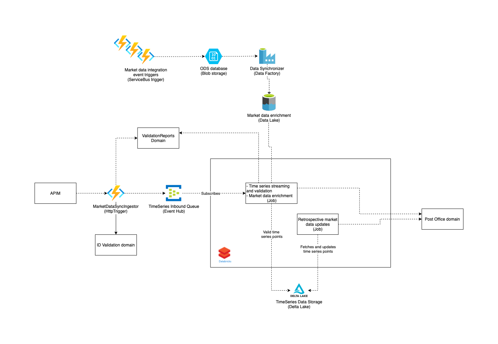

# Time Series

## Intro

The time series domain focuses primarily on receiving, validating and distributing time series data to relevant market participants to be used for billing, etc.

A time series is a message containing a collection of measurements for a given market evaluation point and it documents the amount of electricity being consumed, produced or exchanged. The measurements received can come in different resolutions e.g. hourly or 15 minutes values. Although the domain is built with the intend for higher resolutions like 5 minutes or higher.

Performance is essential for this time series engine as the expected through-put will be high. Current performance target is processing 16 million time series per hour.

The domain is also in charge of responding to time series data requests from market participants, and it is a key input data provider for the calculations performed by the [Calculation domain](https://github.com/Energinet-DataHub/geh-aggregations) in order to settle the electricity market.

These are the business processes maintained by this domain.

| Processes |
| ------------- |
| [Submission of time series data](https://github.com/Energinet-DataHub/geh-timeseries/blob/UpdateRepoDocs/docs/business-workflows.md#submission-of-time-series-data) |
| [Request for time series data](https://github.com/Energinet-DataHub/geh-timeseries/blob/UpdateRepoDocs/docs/business-workflows.md#request-for-time-series-data) |
| [Request for historical time series data](https://github.com/Energinet-DataHub/geh-timeseries/blob/UpdateRepoDocs/docs/business-workflows.md#request-for-historical-time-series-data) |
| ... |

## Architecture

## Context Streams

TODO

## Domain Road Map

TODO

## Getting Started

Learn how to get started with Green Energy Hub [here](https://github.com/Energinet-DataHub/green-energy-hub/blob/main/docs/getting-started.md).

## Where can I get more help?

Code owners? Slack or? Referral to main repository?
